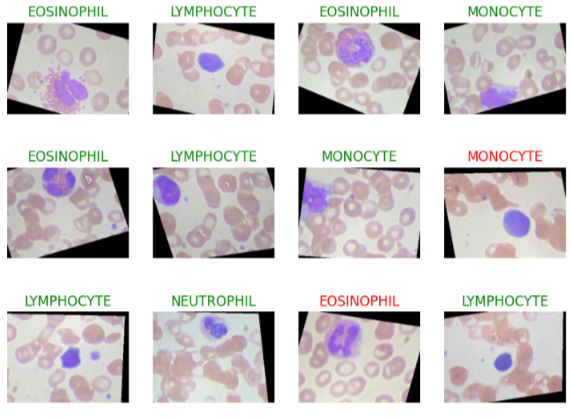

# Blood Cell Classification with CNN

This project implements a Convolutional Neural Network (CNN) for classifying microscopic images of blood cells into four categories.

## Overview

The goal is to build an image classification model that can distinguish between different types of blood cells:

* **Eosinophil**
* **Lymphocyte**
* **Monocyte**
* **Neutrophil**

The model is trained using PyTorch and evaluated with standard metrics such as accuracy and confusion matrix.

## Model Architecture

The model (`BloodCellClassifierV0`) consists of:

* 2 convolutional blocks:

  * Conv2D → BatchNorm → ReLU → Conv2D → BatchNorm → ReLU → MaxPool
* Fully connected classifier:

  * Flatten → Dropout → Linear

### Key design choices:

* Batch Normalization for training stability
* Dropout (0.5) to reduce overfitting
* Simple architecture for fast experimentation

## Dataset

Dataset structure:

This project uses the Blood Cell Images dataset.

- Source: <[dataset link](https://www.kaggle.com/datasets/paultimothymooney/blood-cells)>
- Author: <Paul Mooney>
- License: <MIT License>

```
TRAIN/
  EOSINOPHIL/
  LYMPHOCYTE/
  MONOCYTE/
  NEUTROPHIL/

```

Each class contains RGB microscopy images.

---

## Data Processing

* Images resized to **240×320**
* Converted to tensors
* Dataset split:

  * 80% training
  * 20% validation

---

## Training Setup

* **Framework:** PyTorch
* **Batch size:** 32
* **Optimizer:** SGD (lr = 0.001)
* **Loss function:** CrossEntropyLoss
* **Epochs:** 10
* **Device:** CUDA (if available)

---

## Evaluation

### Metrics:

* Training accuracy
* Validation accuracy
* Loss curves

### Additional analysis:

* Random prediction visualization (correct/incorrect highlighted)

* Confusion matrix (heatmap)

---

## Confusion Matrix

The confusion matrix is computed manually and visualized using Seaborn:

* Rows: True labels
* Columns: Predicted labels

This helps identify which classes are being confused by the model.

---

## Model Saving & Loading

```python
torch.save(model.state_dict(), MODEL_SAVE_PATH)
model.load_state_dict(torch.load(MODEL_SAVE_PATH))
```

---

## How to Run

1. Mount Google Drive:

```python
from google.colab import drive
drive.mount("/content/drive")
```

2. Set dataset paths:

```python
train_dataset_path = "path_to_train"
test_dataset_path = "path_to_test"
```

3. Run training loop

---

## Results

After training the model, the following performance was achieved:

* Train Loss: 0.183
* Test Loss: 0.139
* Train Accuracy: 93.69%
* Test Accuracy: 95.68%

The model achieves high accuracy (>95%) on the test set, indicating strong classification performance.
Test accuracy is slightly higher than training accuracy, which may suggest good generalization or randomness due to dataset split.
Low loss values confirm that the model predictions are confident and consistent.

---

## Limitations

* Small model capacity
* Fixed image resolution
* Manual confusion matrix computation (can be improved)

---

## Possible Improvements

* Use a deeper architecture (ResNet, EfficientNet)
* Use pretrained models (transfer learning)
* Improve evaluation metrics (precision, recall, F1-score)

---

## Key Takeaway

This project demonstrates a full ML pipeline:

* Data loading
* Preprocessing
* Model design
* Training loop
* Evaluation & visualization

---

## Notes

This is an educational project focused on understanding:

* CNN fundamentals
* Training dynamics
* Evaluation techniques
